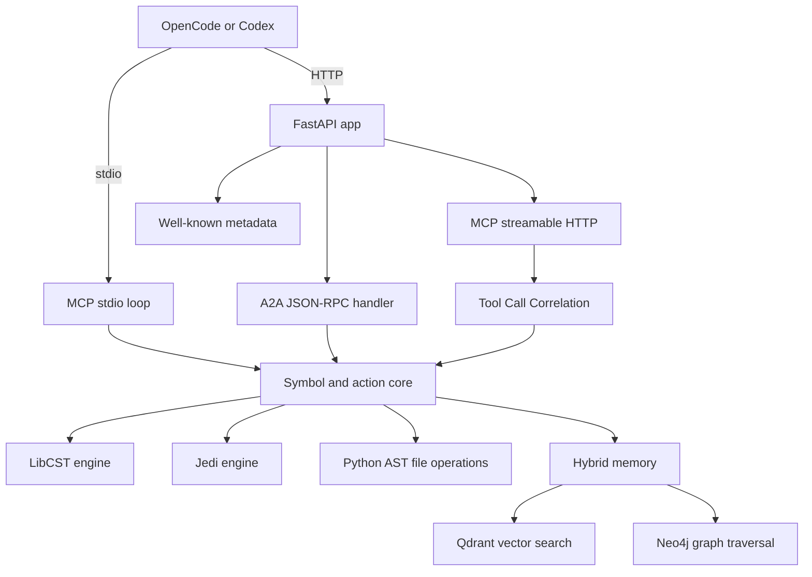

# Simone MCP Architecture

## Summary

Simone MCP uses a Python-first architecture with two transport modes:

1. stdio for local MCP clients
2. streamable HTTP for remote MCP and A2A-facing deployments

Both transports delegate to a shared `protocol.py` handler that implements the full MCP 2026-06-30 specification including Tasks v2 (SEP-2663), HTTP header standardization (SEP-2243), list TTL (SEP-2549), structured output, and resource links.

## Protocol Version

**MCP 2026-06-30** — full compliance including:
- Tasks v2 (SEP-2663): `tasks/get` (inline result), `tasks/update`, `tasks/cancel` + `notifications/tasks`; server decides task creation autonomously; `resultType: "task"` discriminator; `io.modelcontextprotocol/tasks` extension
- HTTP Header Standardization (SEP-2243): `Mcp-Method`, `Mcp-Name`, `Mcp-Param-*` headers; `-32001` HeaderMismatch error
- List TTL (SEP-2549): `ttlMs` + `cacheScope` on all list responses
- Structured output (`structuredContent` + `outputSchema`)
- Tool `title`, `execution.taskSupport` (forbidden/optional/required)
- `resource_link` type in tool results
- Input validation as `isError: true` (SEP-1303)
- `_meta` propagation on all methods
- ISO 8601 timestamps on tasks (`createdAt`, `lastUpdatedAt`)
- SSE `retry:` field
- `MCP-Protocol-Version` HTTP header
- Session cleanup on `DELETE /mcp`

## Core Engines

### LibCST Engine (lossless AST manipulation)

When `libcst` is installed, `replace_symbol_body` uses LibCST's Concrete Syntax Tree instead of Python's native `ast`. LibCST preserves **100% of comments, docstrings, and whitespace formatting** — unlike `ast` which discards them on round-trip. Falls back to `ast` when LibCST is not available.

### Jedi Engine (cross-file symbol resolution)

When `jedi` is installed, `find_references` uses Jedi's AST/goto-based resolution instead of regex. Jedi resolves symbols across files with IDE-level precision (equivalent to JetBrains PSI). Falls back to regex when Jedi is not available.

Both engines report which backend was used via the `engine` field in responses.

## Tool Call Correlation

Every `tools/call` request gets a correlation ID:
- If the client provides `_meta.tool_call_id`, that ID is used
- Otherwise a SHA-256 hash of tool name + arguments is generated
- Correlation state is tracked (in_progress → completed/failed)
- Stale entries are cleaned up automatically

## Current runtime layout

## Why this shape

### Dual transport

The MCP spec in production has converged on streamable HTTP for remote servers, but local clients still benefit from stdio. Simone ships both.

### Python source of truth

The previous repo state contained only compiled JavaScript stubs. The repo now has an actual Python implementation under `src/`.

### Security posture

The HTTP transport validates `Origin` and can require Bearer tokens backed by JWKS validation when OAuth is enabled.

## Transport details

### stdio

`python3 src/cli.py serve-mcp`

Supported methods:

- `initialize` (version negotiation)
- `ping`
- `tools/list` (paginated)
- `tools/call` (with task support, structured output, resource links)
- `tasks/get` (inline result — SEP-2663)
- `tasks/update` (resume input_required tasks — SEP-2663)
- `tasks/cancel` (rejects terminal tasks with -32602)
- `resources/list` (paginated)
- `resources/read` (path traversal protected)
- `resources/subscribe`
- `resources/unsubscribe`
- `resources/templates/list` (paginated)
- `prompts/list` (paginated)
- `prompts/get`
- `logging/setLevel` (emits notifications/message)
- `completion/complete`
- `sampling/createMessage` (returns error — use HTTP)
- `elicitation/create` (returns error — rephrase as tool call)

### streamable HTTP

`python3 src/cli.py serve`

Endpoint:

- `GET|POST|DELETE /mcp`

Implemented behavior:

- `initialize` returns protocol/version metadata and a session id
- `tools/list` returns the tool registry
- `tools/call` executes the action surface with correlation tracking
- `GET /mcp` opens an SSE-compatible event stream response
- `DELETE /mcp` accepts explicit session shutdown

## Action surface

The current implementation provides:

- symbol lookup (`sin_simone_mcp_symbol_search`)
- cross-file reference search (`sin_simone_mcp_find_references`) — Jedi or regex
- structural editing (`sin_simone_mcp_structural_edit`) — LibCST or ast
- hybrid memory query (`sin_simone_mcp_memory_query`)
- workspace overview (`sin_simone_mcp_project_overview`)
- health check (`sin_simone_mcp_health`)
- task-augmented execution for long-running operations
- structured output with JSON Schema 2020-12 outputSchema on all tools

## Memory strategy

Simone uses a hybrid memory contract:

- **Qdrant** for vector recall — queries collection metadata and point counts
- **Neo4j** for relationship-aware expansion — traces CALLS/IMPORTS edges from target symbols

When both backends are configured, queries execute against both and merge results. When neither is configured, the facade returns an empty result set with `enabled: false`.

## A2A surface

`POST /a2a/v1`

Implemented methods:

- `agent.discover` — returns the agent card
- `agent.ping` — health check with timestamp
- `tool.list` — lists available MCP tools
- `tool.call` — executes a tool with correlation tracking

The A2A layer translates incoming actions into the same core execution surface used by MCP.

## Metadata surface

Simone publishes:

- `/.well-known/agent-card.json`
- `/.well-known/agent.json`
- `/.well-known/oauth-client.json`
- `/.well-known/oauth-authorization-server`

## CLI commands

| Command | Description |
|---------|-------------|
| `serve` | Start HTTP/A2A server (port 8234) |
| `serve-mcp` | Start MCP stdio server |
| `print-card` | Print agent discovery card |
| `run-action JSON` | Execute a tool action |
| `index [PATH]` | Show project overview |
| `validate` | Validate server configuration |
| `tool-list` | List available MCP tools |

## Deployment model

### Local

- editable install
- pytest verification
- stdio MCP integration via `mcp-config.json`

### Container

- multi-stage Docker build (builder + production)
- uv-based install for fast dependency resolution
- non-root user (`simone`)
- health check endpoint
- docker-compose stack with Qdrant and Neo4j

### Hugging Face Spaces

Use Spaces as compute and UI. Keep durable state in external systems or mounted storage rather than assuming local filesystem persistence.

## Validation targets

- `pytest tests/ -v`
- `python3 src/cli.py print-card`
- `python3 src/cli.py validate`
- `python3 src/cli.py run-action '{"action":"simone.mcp.health"}'`
- stdio initialize/tools flow
- HTTP health and metadata endpoints