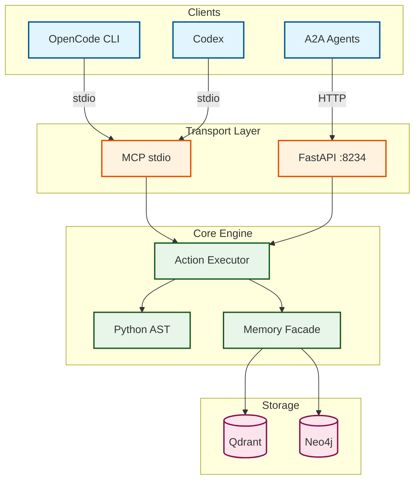

<p align="center">
  
</p>

<p align="center">
  <a href="https://github.com/Delqhi/Simone-MCP/blob/main/LICENSE">
    
  </a>
  <a href="https://www.python.org/downloads/">
    
  </a>
  <a href="https://fastapi.tiangolo.com/">
    
  </a>
  <a href="https://github.com/modelcontextprotocol">
    
  </a>
  <a href="https://github.com/Delqhi/Simone-MCP/stargazers">
    
  </a>
  <a href="https://github.com/Delqhi/Simone-MCP/actions">
    
  </a>
</p>

<p align="center">
  <a href="#quick-start">Quick Start</a> ·
  <a href="#features">Features</a> ·
  <a href="#architecture">Architecture</a> ·
  <a href="#use-cases">Use Cases</a> ·
  <a href="#commands">Commands</a> ·
  <a href="#deploy">Deploy</a> ·
  <a href="#contributing">Contributing</a>
</p>

<p align="center">
  <em>Production-grade Code-Worker with symbol operations, dual MCP transports, OAuth 2.1 readiness, and hybrid memory integrations.</em>
</p>

---

## What is Simone MCP?

> Simone MCP is a **production-grade code worker** that transforms how AI agents navigate and manipulate code. Powered by **OpenAI** (`gpt-5.4`) with **NVIDIA** fallback, it provides **AST-level symbol operations** through the Model Context Protocol — giving OpenCode, Codex, and A2A agents surgical precision for code understanding and transformation.

**Think of it as a semantic search engine + code surgeon combined into one MCP server.**

---

## Quick Start

> [!TIP]
> Get Simone MCP running in under 60 seconds. No configuration required for basic usage.

<table>
<tr>
<td width="33%" align="center">
<strong>1. Clone</strong><br/><br/>
<code>git clone</code><br/><code>Delqhi/Simone-MCP</code><br/><br/>

</td>
<td width="33%" align="center">
<strong>2. Install</strong><br/><br/>
<code>pip install -e .[dev]</code><br/><br/>

</td>
<td width="33%" align="center">
<strong>3. Run</strong><br/><br/>
<code>python src/cli.py serve</code><br/><br/>

</td>
</tr>
</table>

**That's it.** Server is now running at `http://localhost:8234` with full MCP, A2A, and `.well-known` endpoints.

---

## Features

| Capability | Description | Status |
|:---|:---|:---:|
| **Symbol Operations** | AST-level find, replace, and insert for Python functions and classes | ✅ |
| **Dual Transport** | stdio for local clients + streamable HTTP for remote deployments | ✅ |
| **A2A Integration** | JSON-RPC endpoint for agent-to-agent communication | ✅ |
| **OAuth 2.1 Ready** | Bearer token validation with JWKS support | ✅ |
| **Hybrid Memory** | Qdrant (vector) + Neo4j (graph) retrieval architecture | ✅ |
| **Discovery** | `.well-known` metadata for agent cards and OAuth config | ✅ |
| **Docker Ready** | Single-image deployment with docker-compose for full stack | ✅ |
| **HF Spaces** | Stateless compute deployment pattern documented | ✅ |

<details>
<summary>📦 Full tool surface</summary>

| Tool | Type | Description |
|:---|:---|:---|
| `code.find_symbol` | Read | Locate symbol definitions across workspace |
| `code.find_references` | Read | Find textual references to a symbol |
| `code.replace_symbol_body` | Write | Replace the body of a Python function |
| `code.insert_after_symbol` | Write | Insert text immediately after a symbol block |
| `code.project_overview` | Read | Summarize workspace footprint and file types |
| `memory.query` | Read | Hybrid memory search via Qdrant + Neo4j |
| `simone.mcp.health` | Meta | Server health check and status |
| `agent.help` | Meta | List all available actions and capabilities |

</details>

---

## Architecture



> 📖 **Deep dive:** Full architecture docs with 12+ diagrams at [docs/architecture.md](docs/architecture.md)

---

## Use Cases

| Who | Problem | Solution |
|:---|:---|:---|
| **🧑‍💻 Developer** | Manual code navigation in large repos | Symbol-level precision lookup in milliseconds |
| **🤖 A2A Agent** | No code understanding beyond text search | AST-parsed operations via standardized MCP |
| **👨‍💼 Team Lead** | Slow developer onboarding | Instant repo structure overview and navigation |
| **🏢 Enterprise** | Code quality and consistency at scale | Automated structural edits with validation |

---

## Commands

<details open>
<summary>🚀 Serve (Production)</summary>

```bash
# HTTP Server (default port 8234)
python3 src/cli.py serve

# Custom port
python3 src/cli.py serve 9000
```

</details>

<details>
<summary>🔌 MCP stdio (Local Development)</summary>

```bash
# MCP stdio mode for OpenCode/Codex
python3 src/cli.py serve-mcp
```

</details>

<details>
<summary>🃏 Agent Card & Actions</summary>

```bash
# Print agent discovery card
python3 src/cli.py print-card

# Execute a specific action
python3 src/cli.py run-action '{"action":"simone.mcp.health"}'
python3 src/cli.py run-action '{"action":"code.find_symbol","symbol":"my_function"}'
```

</details>

<details>
<summary>🧪 Validation</summary>

```bash
# Run test suite
pytest tests/ -v
```

</details>

---

## Deploy

| Method | Command | Best For |
|:---|:---|:---|
| **Local** | `pip install -e .[dev]` | Development, testing |
| **Docker** | `docker-compose up --build` | Production, CI/CD |
| **HF Spaces** | Push to Hugging Face Spaces | Stateless compute, demos |

<details>
<summary>🐳 Docker Compose (Full Stack)</summary>

```bash
# Starts Simone MCP + Qdrant + Neo4j
docker-compose up --build

# Services:
#   Simone MCP  → http://localhost:8234
#   Qdrant      → http://localhost:6333
#   Neo4j       → http://localhost:7474
```

</details>

> [!WARNING]
> **HF Spaces:** Hugging Face Spaces provide stateless compute only. Use external services (Supabase, Qdrant Cloud, Neo4j Aura) for persistent state. Never assume local disk durability.

---

## Configuration

Copy `.env.example` to `.env` and configure the values you need:

<details>
<summary>🔐 Environment Variables</summary>

| Variable | Purpose | Default |
|:---|:---|:---|
| `SIMONE_AUTH_REQUIRED` | Enable OAuth validation | `false` |
| `SIMONE_OAUTH_AUDIENCE` | JWT audience claim | `simone-mcp` |
| `SIMONE_OAUTH_ISSUER` | OAuth issuer URL | — |
| `SIMONE_OAUTH_JWKS_URL` | JWKS endpoint for token validation | — |
| `SIMONE_ALLOWED_ORIGINS` | CORS origin whitelist | `http://localhost` |
| `QDRANT_URL` | Vector database endpoint | — |
| `NEO4J_URI` | Graph database endpoint | — |
| `SUPABASE_URL` | Supabase project URL | — |

</details>

---

## Contributing

Contributions are welcome! Here's how to get started:

1. **Fork** the repository
2. **Create** your feature branch (`git checkout -b feature/amazing-feature`)
3. **Commit** your changes (`git commit -m 'Add amazing feature'`)
4. **Push** to the branch (`git push origin feature/amazing-feature`)
5. **Open** a Pull Request

> [!NOTE]
> Please ensure all tests pass (`pytest tests/ -v`) and run `python3 src/cli.py print-card` to verify the agent card is valid before submitting.

---

## License

Distributed under the **MIT License**. See [LICENSE](LICENSE) for more information.

---

<p align="center">
  <a href="https://opensin.ai">
    
  </a>
</p>

<p align="center">
  <sub>Entwickelt vom <a href="https://opensin.ai"><strong>OpenSIN-AI</strong></a> Ökosystem – Enterprise AI Agents die autonom arbeiten.</sub><br/>
  <sub>🌐 <a href="https://opensin.ai">opensin.ai</a> · 💬 <a href="https://opensin.ai/agents">Alle Agenten</a> · 🚀 <a href="https://opensin.ai/dashboard">Dashboard</a></sub>
</p>
