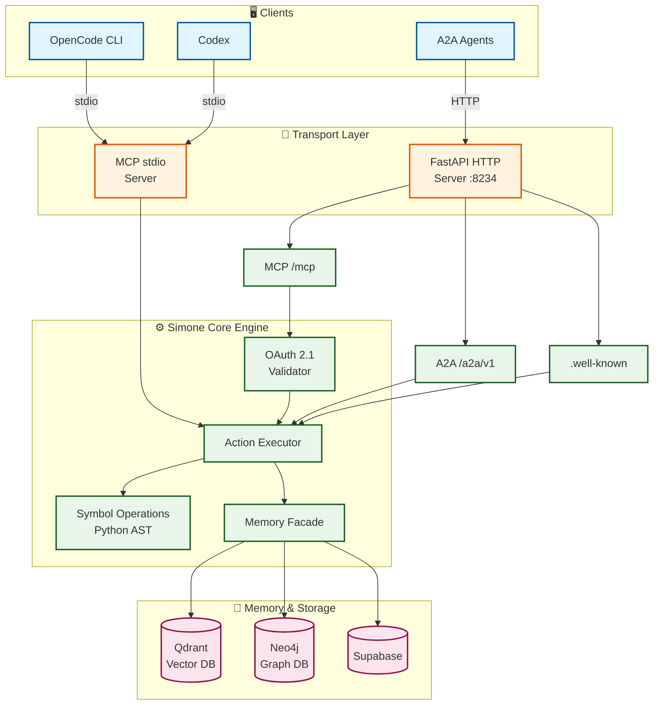
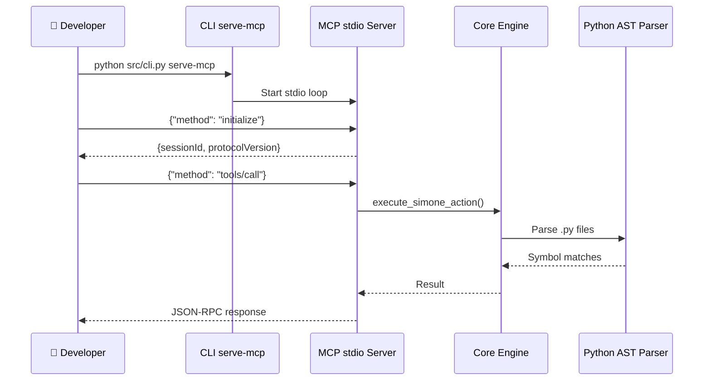
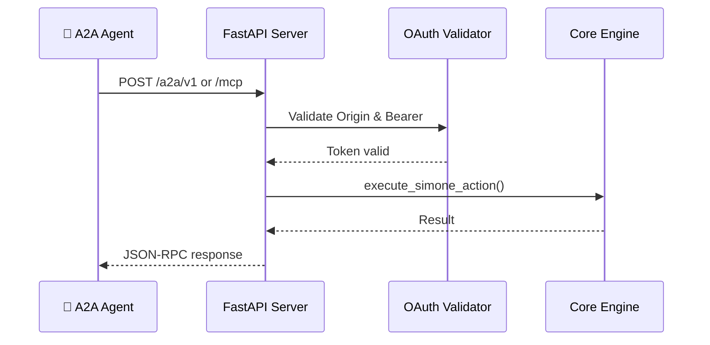
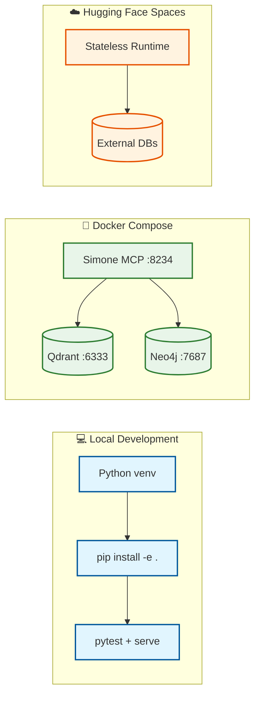
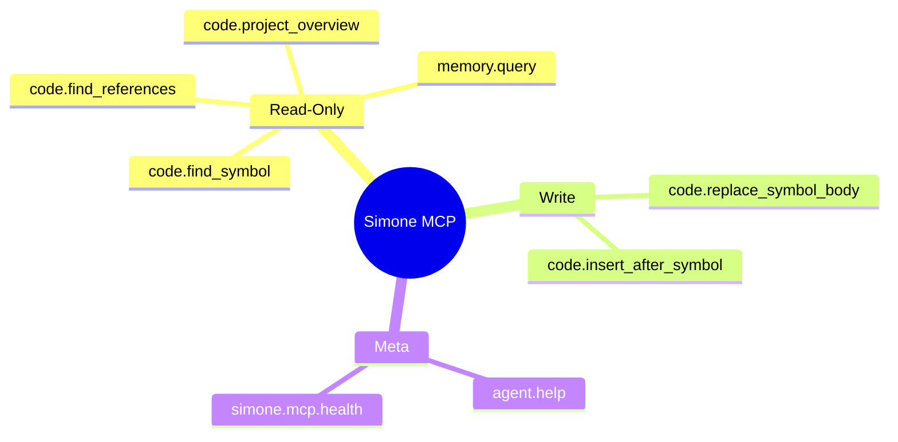

<p align="center">
  
</p>

# Simone MCP

Simone MCP is a production-grade code worker for the OpenSIN ecosystem. It combines a real Python implementation, dual MCP transports, A2A discovery, symbol-level code operations, OAuth 2.1 readiness, and hybrid memory integration points.

## 📊 Visual Architecture Overview



## 🔄 Request Flow

### Local Development (stdio)



### Remote HTTP (Streamable)



## 🚀 Deployment Options



## 🛠️ Tool Surface



---

## Fleet policy

- Every OpenCode agent in this ecosystem must use Simone MCP when it is available.
- PCPM is the required planning/memory layer before a repo task begins.
- Local development uses stdio; remote use uses the HF Space / streamable HTTP shape.

## What is implemented now

- Python source of truth under `src/`
- MCP stdio server for local OpenCode/Codex usage
- MCP streamable HTTP server at `/mcp`
- A2A JSON-RPC endpoint at `/a2a/v1`
- `.well-known` discovery metadata
- Symbol tools for Python workspaces
- Structural edits for Python functions and class-adjacent insertion
- Dashboard endpoint with operator quick actions
- Docker and docker-compose scaffolding
- n8n-dispatch CI wrapper workflow

## April 2026 design choices

- Use **Streamable HTTP** for remote MCP, not deprecated HTTP+SSE split endpoints
- Keep **stdio** for local client compatibility
- Validate **Origin** on HTTP transport
- Prepare for **OAuth 2.1** with Bearer + JWKS validation
- Prefer **hybrid retrieval**: vector-first candidate selection and graph-aware expansion
- Treat **Hugging Face Spaces as stateless compute** and keep durable state remote

## Quick start

```bash
git clone https://github.com/Delqhi/Simone-MCP.git
cd Simone-MCP
python3 -m venv .venv
source .venv/bin/activate
pip install -e .[dev]
pytest tests/ -v
python3 src/cli.py print-card
python3 src/cli.py serve
```

## Main commands

```bash
python3 src/cli.py serve
python3 src/cli.py serve-mcp
python3 src/cli.py print-card
python3 src/cli.py run-action '{"action":"simone.mcp.health"}'
```

## HTTP endpoints

- `GET /health`
- `GET /dashboard`
- `GET /.well-known/agent-card.json`
- `GET /.well-known/agent.json`
- `GET /.well-known/oauth-client.json`
- `GET /.well-known/oauth-authorization-server`
- `POST /a2a/v1`
- `GET|POST|DELETE /mcp`

## Core tool surface

- `code.find_symbol`
- `code.find_references`
- `code.replace_symbol_body`
- `code.insert_after_symbol`
- `code.project_overview`
- `memory.query`
- `simone.mcp.health`

## Docker

```bash
docker-compose up --build
```

## Configuration

Copy `.env.example` to `.env` and set the values you actually use.

Important runtime variables:

- `SIMONE_AUTH_REQUIRED`
- `SIMONE_OAUTH_AUDIENCE`
- `SIMONE_OAUTH_ISSUER`
- `SIMONE_OAUTH_JWKS_URL`
- `SIMONE_ALLOWED_ORIGINS`
- `QDRANT_URL`
- `NEO4J_URI`
- `SUPABASE_URL`

## Validation

```bash
pytest tests/ -v
python3 src/cli.py print-card
python3 src/cli.py run-action '{"action":"simone.mcp.health"}'
```

## CI

The repository is configured for the thin OpenSIN CI dispatch model through `OpenSIN-AI/sin-github-action` and an n8n webhook secret.

## Deployment note

For Hugging Face Spaces, prefer remote persistence or mounted volumes instead of assuming local disk durability for long-lived agent state.

## 📚 Detailed Documentation

For comprehensive visual documentation including:
- OAuth 2.1 Authentication Flow
- Memory Integration Architecture  
- Security Architecture
- CI/CD Pipeline
- File Structure Diagram
- Agent Card & Discovery

👉 See [docs/architecture.md](docs/architecture.md)

## License

MIT
