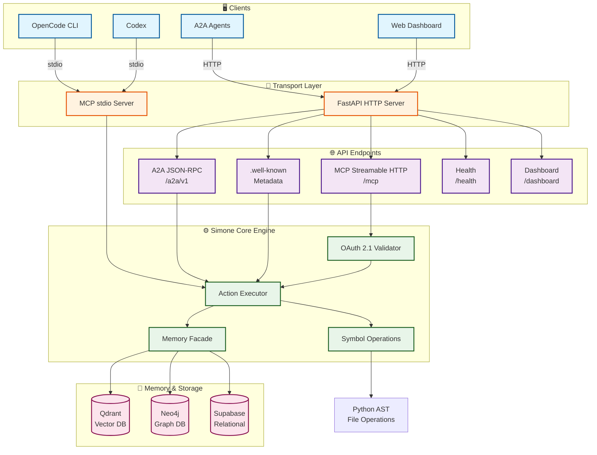
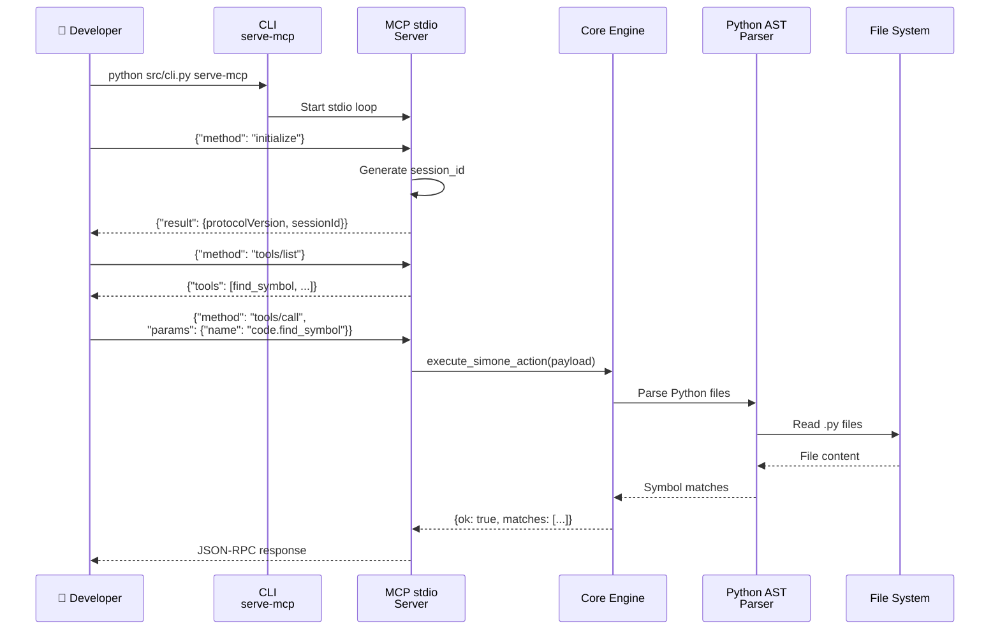
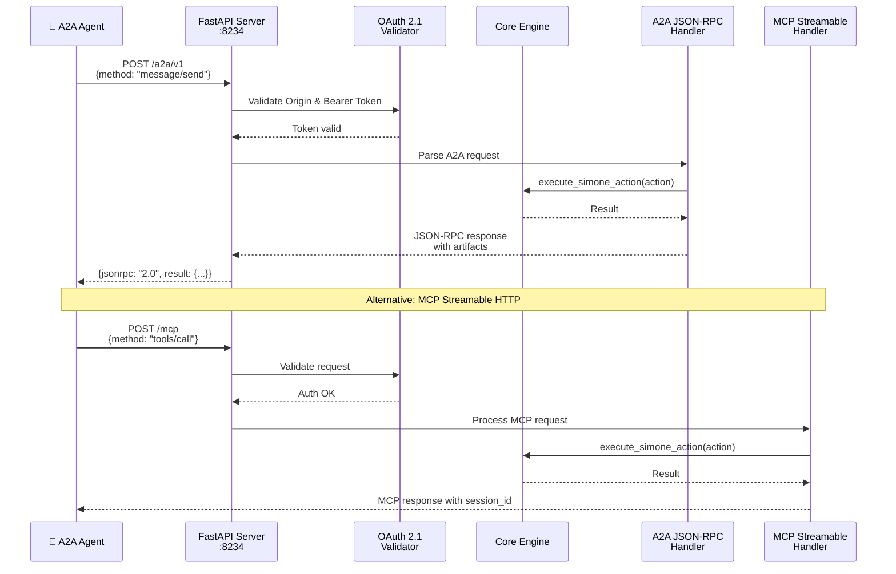
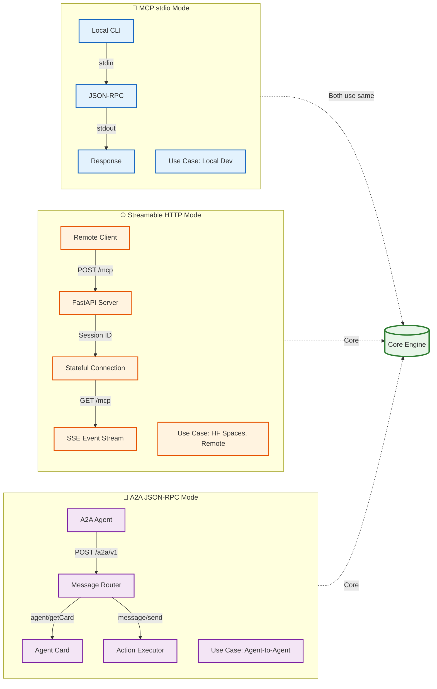
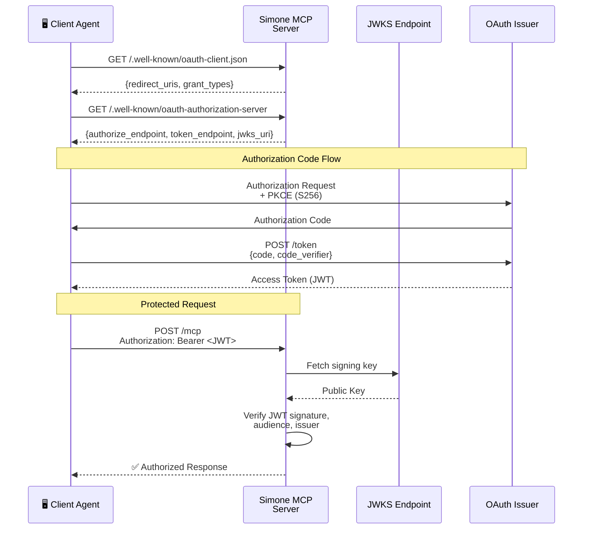
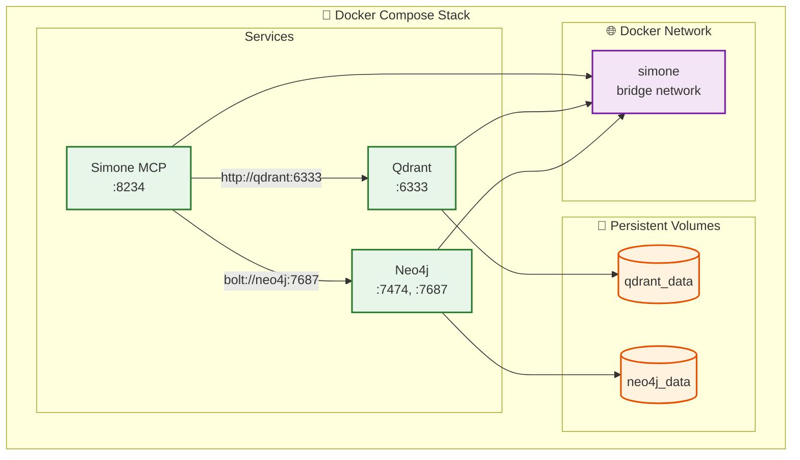
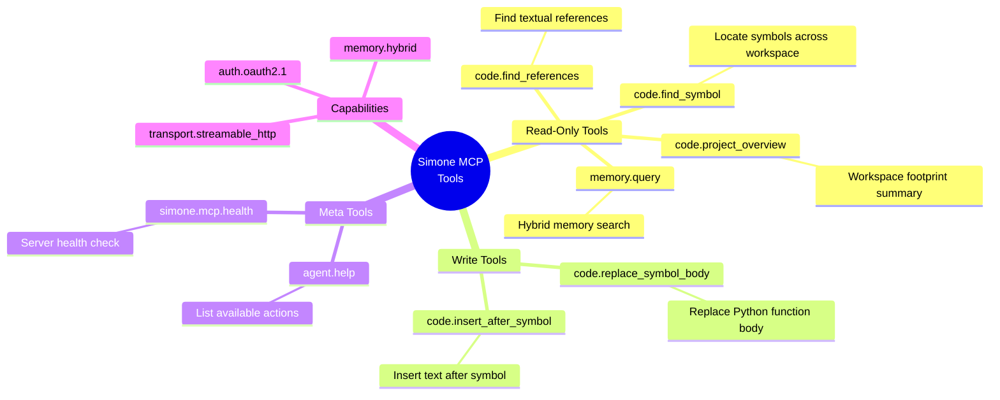
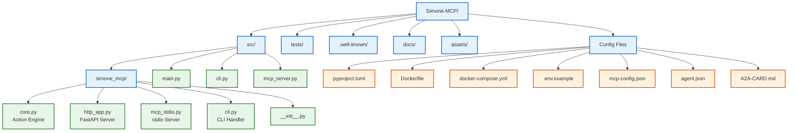

# Simone MCP Architecture Documentation

> **Bilder sagen mehr als tausend Worte** - Visuelle Dokumentation der Simone MCP Architektur

## Übersicht

Simone MCP ist ein production-grade Code Worker für das OpenSIN Ökosystem mit dualen MCP Transports, A2A Discovery, Symbol-Level Code Operationen und Hybrid Memory Integration.

---

## 1. System Architecture Overview



---

## 2. Request Flow Diagrams

### 2.1 Local Development Flow (stdio)



### 2.2 Remote HTTP Flow (Streamable HTTP)



---

## 3. MCP Transport Comparison



---

## 4. Symbol Operations Deep Dive

```mermaid
graph TD
    subgraph FindSymbol["🔍 code.find_symbol"]
        FS1[Input: symbol name + root] --> FS2[Scan .py files recursively]
        FS2 --> FS3[Parse each file with ast.parse]
        FS3 --> FS4[Walk AST tree]
        FS4 --> FS5{Node type?}
        FS5 -->|FunctionDef| FS6[function]
        FS5 -->|AsyncFunctionDef| FS7[async_function]
        FS5 -->|ClassDef| FS8[class]
        FS6 --> FS9[Match symbol name]
        FS7 --> FS9
        FS8 --> FS9
        FS9 --> FS10[Return: file, line, column, kind]
    end

    subgraph ReplaceBody["✏️ code.replace_symbol_body"]
        RB1[Input: symbol + file + new body] --> RB2[Find symbol node in AST]
        RB2 --> RB3[Extract function boundaries]
        RB3 --> RB4[Calculate indentation]
        RB4 --> RB5[Replace line range]
        RB5 --> RB6[Preserve trailing newline]
        RB6 --> RB7[Write updated file]
    end

    subgraph InsertAfter["📝 code.insert_after_symbol"]
        IA1[Input: symbol + file + text] --> IA2[Find symbol end_lineno]
        IA2 --> IA3[Insert text after node]
        IA3 --> IA4[Write updated file]
    end

    classDef find fill:#e1f5fe,stroke:#01579b,stroke-width:2px
    classDef replace fill:#fff3e0,stroke:#e65100,stroke-width:2px
    classDef insert fill:#f3e5f5,stroke:#4a148c,stroke-width:2px

    class FS1,FS2,FS3,FS4,FS5,FS6,FS7,FS8,FS9,FS10 find
    class RB1,RB2,RB3,RB4,RB5,RB6,RB7 replace
    class IA1,IA2,IA3,IA4 insert
```



---

## 5. OAuth 2.1 Authentication Flow



---

## 6. Memory Integration Architecture

```mermaid
graph TB
    subgraph Query["🧠 Hybrid Memory Query"]
        Q1[memory.query<br/>Input: search query] --> Q2[Memory Facade]
    end

    subgraph Vector["📊 Vector Search - Qdrant"]
        Q2 -->|If QDRANT_URL configured| V1[Generate embeddings]
        V1 --> V2[Query Qdrant collections]
        V2 --> V3[Return top-k similar chunks]
    end

    subgraph Graph["🕸️ Graph Search - Neo4j"]
        Q2 -->|If NEO4J_URI configured| G1[Cypher query generation]
        G1 --> G2[Query Neo4j graph]
        G2 --> G3[Return related entities]
    end

    subgraph Fusion["🔄 Result Fusion"]
        V3 --> F1[Merge & rank results]
        G3 --> F1
        F1 --> F2[Return unified response]
    end

    Q1:::query
    Q2:::facade
    V1:::vector
    V2:::vector
    V3:::vector
    G1:::graph
    G2:::graph
    G3:::graph
    F1:::fusion
    F2:::fusion

    classDef query fill:#e1f5fe,stroke:#01579b,stroke-width:2px
    classDef facade fill:#fff9c4,stroke:#f57f17,stroke-width:2px
    classDef vector fill:#e8f5e9,stroke:#2e7d32,stroke-width:2px
    classDef graph fill:#f3e5f5,stroke:#7b1fa2,stroke-width:2px
    classDef fusion fill:#ffe0b2,stroke:#e65100,stroke-width:2px
```

---

## 7. Deployment Topology

### 7.1 Local Development

```mermaid
graph LR
    DEV[Developer Machine] --> PYTHON[Python 3.12 venv]
    PYTHON --> PIP[pip install -e .[dev]]
    PIP --> TEST[pytest tests/ -v]
    TEST --> SERVE[python src/cli.py serve]
    SERVE --> LOCAL[http://localhost:8234]
    
    classDef dev fill:#e1f5fe,stroke:#01579b,stroke-width:2px
    classDev DEV,PYTHON,PIP,TEST,SERVE,LOCAL dev
```

### 7.2 Docker Compose Stack



### 7.3 Hugging Face Spaces Deployment

```mermaid
graph TB
    subgraph HF["Hugging Face Spaces"]
        SPACE[Space Runtime<br/>Stateless Compute]
        APP[Simone MCP App<br/>Port 7860]
    end

    subgraph External["External Persistent Storage"]
        SUPABASE[(Supabase DB)]
        REMOTE_QDRANT[(Remote Qdrant)]
        REMOTE_NEO4J[(Remote Neo4j)]
    end

    SPACE --> APP
    APP -->|Environment Variables| SUPABASE
    APP -->|SIMONE_* env vars| REMOTE_QDRANT
    APP -->|NEO4J_URI env var| REMOTE_NEO4J

    Note over SPACE: ⚠️ No local disk persistence!<br/>Use external services for state

    classDef hf fill:#ffeb3b,stroke:#f57f17,stroke-width:2px
    classDef external fill:#e1f5fe,stroke:#01579b,stroke-width:2px

    class SPACE,APP hf
    class SUPABASE,REMOTE_QDRANT,REMOTE_NEO4J external
```

---

## 8. Tool Surface & Capabilities



---

## 9. CI/CD Pipeline

```mermaid
graph LR
    subgraph Dev["👨‍💻 Development"]
        CODE[Code Changes] --> COMMIT[Git Commit]
        COMMIT --> PUSH[Push to GitHub]
    end

    subgraph CI["🔄 CI Pipeline"]
        PUSH --> TRIGGER[GitHub Actions Trigger]
        TRIGGER --> LINT[Lint & Type Check]
        LINT --> TEST[pytest tests/ -v]
        TEST --> CARD[print-card validation]
        CARD --> HEALTH[health check]
    end

    subgraph Deploy["🚀 Deployment"]
        HEALTH --> BUILD[Docker Build]
        BUILD --> PUSH_IMG[Push to Registry]
        PUSH_IMG --> DEPLOY_HF[Deploy to HF Spaces]
        DEPLOY_HF --> VERIFY[Health Verification]
    end

    classDef dev fill:#e1f5fe,stroke:#01579b,stroke-width:2px
    classDef ci fill:#fff3e0,stroke:#e65100,stroke-width:2px
    classDef deploy fill:#e8f5e9,stroke:#2e7d32,stroke-width:2px

    class CODE,COMMIT,PUSH dev
    class TRIGGER,LINT,TEST,CARD,HEALTH ci
    class BUILD,PUSH_IMG,DEPLOY_HF,VERIFY deploy
```



---

## 10. File Structure



---

## 11. Security Architecture

```mermaid
graph TB
    subgraph Request["📨 Incoming Request"]
        REQ[HTTP Request] --> ORIGIN[Origin Validation]
    end

    subgraph Auth["🔐 Authentication Layer"]
        ORIGIN -->|Origin allowed?| AUTH_CHECK{Auth Required?}
        AUTH_CHECK -->|No| PASS[Proceed]
        AUTH_CHECK -->|Yes| BEARER{Bearer Token?}
        BEARER -->|No| 401[401 Unauthorized]
        BEARER -->|Yes| JWT[JWT Validation]
        JWT --> JWKS[Fetch JWKS Key]
        JWKS --> VERIFY{Valid Signature?}
        VERIFY -->|No| 401_ERR[401 Invalid Token]
        VERIFY -->|Yes| AUD{Audience Match?}
        AUD -->|No| 401_AUD[401 Invalid Audience]
        AUD -->|Yes| PASS
    end

    subgraph Open["🔓 Open Endpoints"]
        OPEN_LIST[/, /health, /dashboard,<br/>.well-known/*]
    end

    REQ -.->|Skip auth for| OPEN_LIST

    classDef request fill:#e1f5fe,stroke:#01579b,stroke-width:2px
    classDef auth fill:#fff3e0,stroke:#e65100,stroke-width:2px
    classDef open fill:#e8f5e9,stroke:#2e7d32,stroke-width:2px
    classDef error fill:#ffebee,stroke:#c62828,stroke-width:2px

    class REQ,ORIGIN request
    class AUTH_CHECK,BEARER,JWT,JWKS,VERIFY,AUD,PASS auth
    class OPEN_LIST open
    class 401,401_ERR,401_AUD error
```

---

## 12. Agent Card & Discovery

```mermaid
graph LR
    subgraph WellKnown["🔍 .well-known Endpoints"]
        CARD[/.well-known/<br/>agent-card.json]
        AGENT[/.well-known/<br/>agent.json]
        OAUTH_CLIENT[/.well-known/<br/>oauth-client.json]
        OAUTH_SERVER[/.well-known/<br/>oauth-authorization-server]
    end

    subgraph CardContent["📋 Agent Card Content"]
        NAME[name: simone-mcp]
        VERSION[version: 2026.04.12]
        CAPS[capabilities: [...]]
        ENDPOINTS[endpoints: {...}]
        SKILLS[skills: [...]]
        AUTH_CONFIG[auth: {type: oauth2.1}]
    end

    CARD --> NAME
    CARD --> VERSION
    CARD --> CAPS
    CARD --> ENDPOINTS
    CARD --> SKILLS
    CARD --> AUTH_CONFIG

    classDef wk fill:#f3e5f5,stroke:#7b1fa2,stroke-width:2px
    classDef content fill:#e8f5e9,stroke:#2e7d32,stroke-width:2px

    class CARD,AGENT,OAUTH_CLIENT,OAUTH_SERVER wk
    class NAME,VERSION,CAPS,ENDPOINTS,SKILLS,AUTH_CONFIG content
```

---

## Zusammenfassung

Simone MCP bietet:

- **Duale Transports**: stdio für lokale Entwicklung, Streamable HTTP für Remote
- **A2A Integration**: JSON-RPC Endpoint für Agent-to-Agent Kommunikation  
- **Symbol-Level Operations**: Python AST-basierte Code-Navigation und -Manipulation
- **OAuth 2.1 Ready**: Bearer Token Validation mit JWKS
- **Hybrid Memory**: Qdrant (Vector) + Neo4j (Graph) Integration
- **Production-Ready**: Docker, docker-compose, HF Spaces Deployment
- **Discovery**: .well-known Metadata für Agent Card und OAuth Configuration
