# Simone MCP Architecture Documentation

> **Bilder sagen mehr als tausend Worte** - Visuelle Dokumentation der Simone MCP Architektur

## Übersicht

Simone MCP ist ein production-grade Code Worker für das OpenSIN Ökosystem mit dualen MCP Transports, A2A Discovery, Symbol-Level Code Operationen und Hybrid Memory Integration.

---

## 1. System Architecture Overview

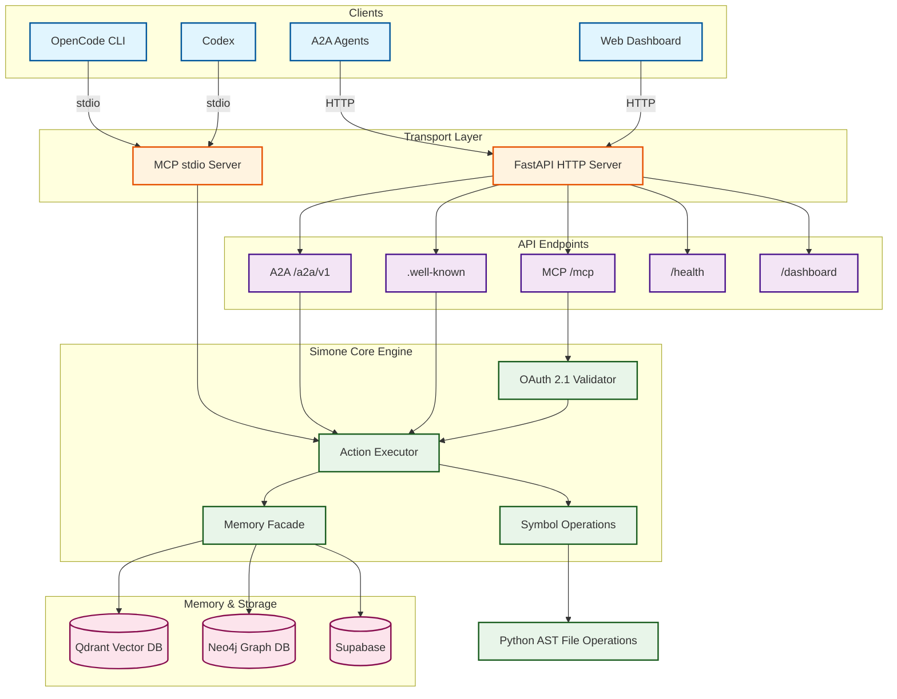

---

## 2. Request Flow Diagrams

### 2.1 Local Development Flow (stdio)

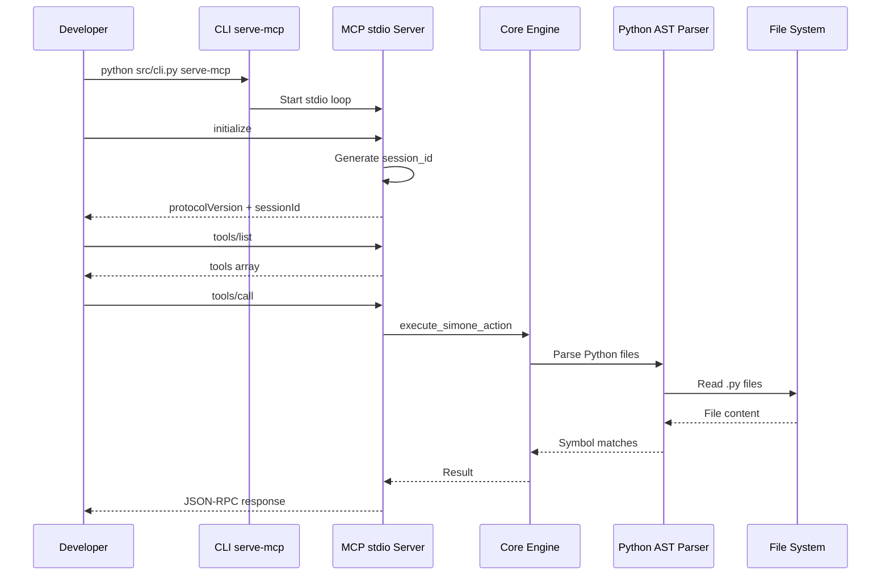

### 2.2 Remote HTTP Flow (Streamable HTTP)

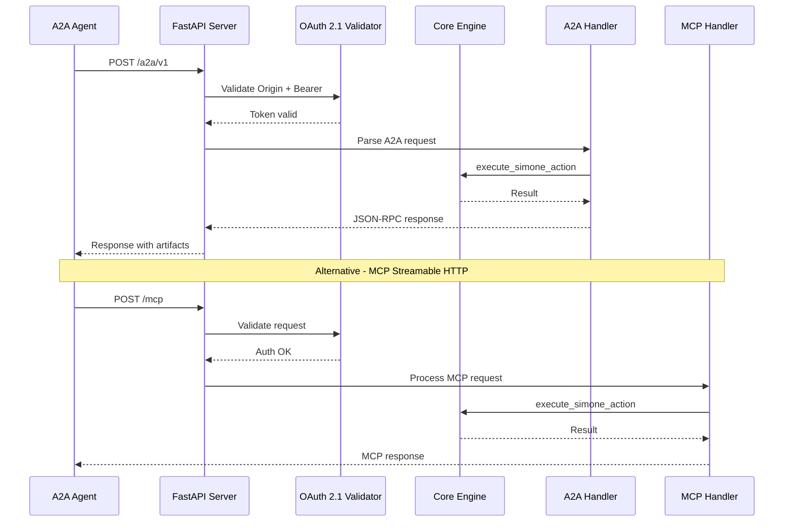

---

## 3. MCP Transport Comparison

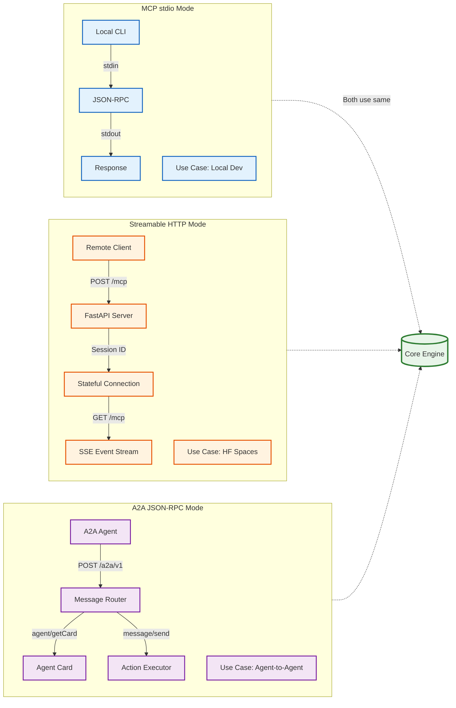

---

## 4. Symbol Operations Deep Dive

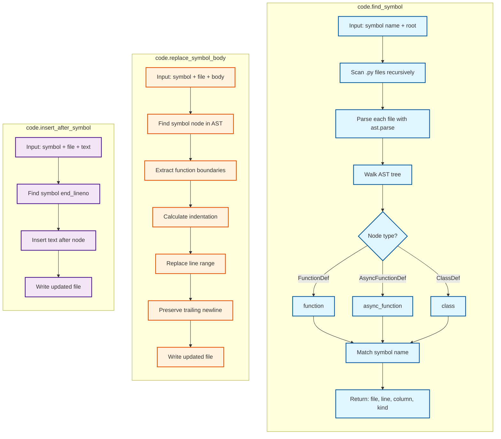

---

## 5. OAuth 2.1 Authentication Flow

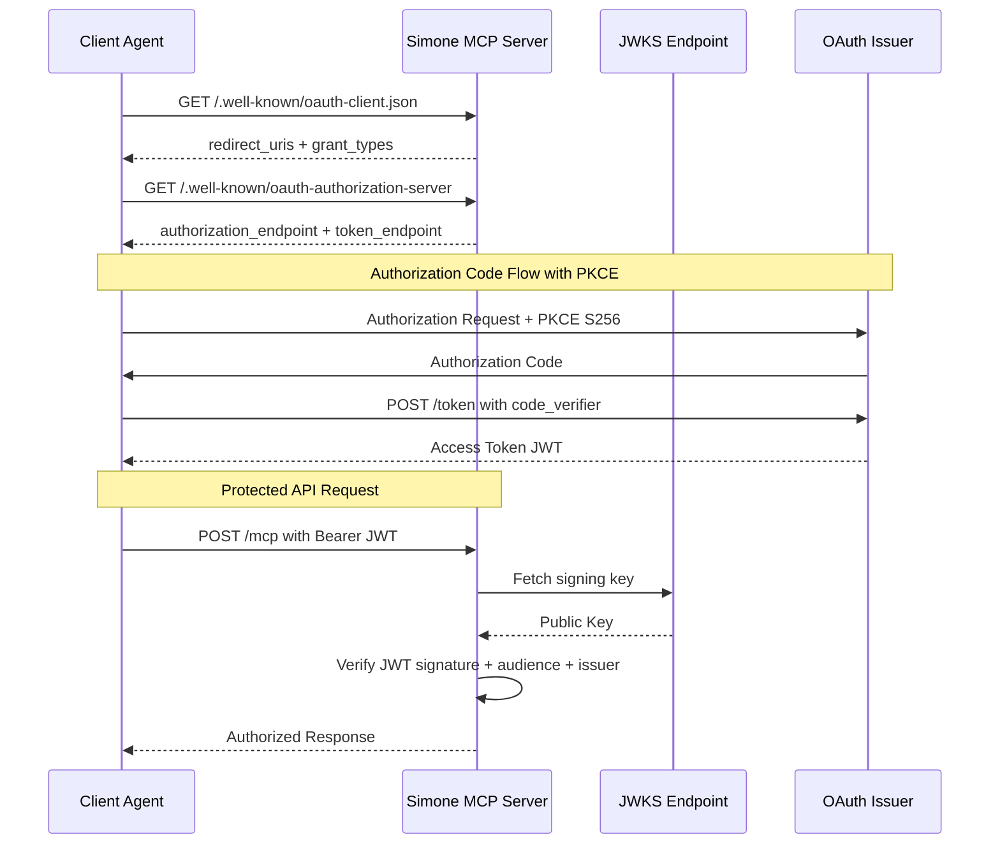

---

## 6. Memory Integration Architecture

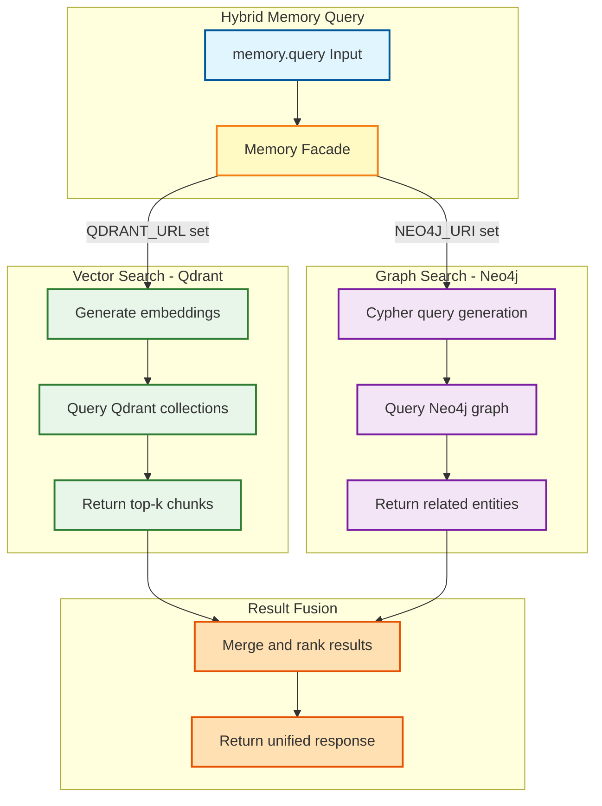

---

## 7. Deployment Topology

### 7.1 Local Development

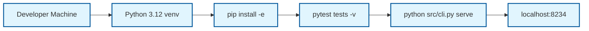

### 7.2 Docker Compose Stack

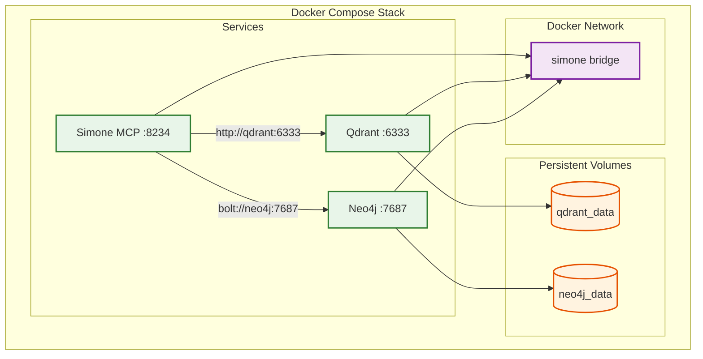

### 7.3 Hugging Face Spaces Deployment

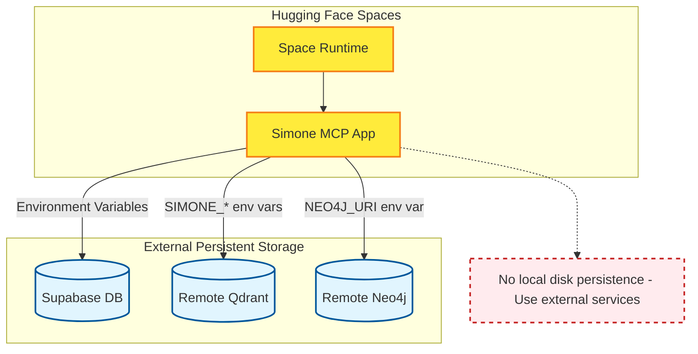

---

## 8. Tool Surface & Capabilities

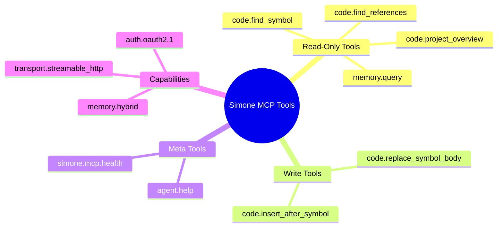

---

## 9. CI/CD Pipeline

```mermaid
flowchart LR
    subgraph DevPhase["Development"]
        CODE["Code Changes"] --> COMMIT["Git Commit"]
        COMMIT --> PUSH["Push to GitHub"]
    end

    subgraph CIPhase["CI Pipeline"]
        TRIGGER["GitHub Actions"] --> LINT["Lint + Type Check"]
        LINT --> TEST["pytest tests -v"]
        TEST --> CARD["print-card validation"]
        CARD --> HEALTHCHECK["health check"]
    end

    subgraph DeployPhase["Deployment"]
        BUILD["Docker Build"] --> PUSHIMG["Push to Registry"]
        PUSHIMG --> DEPLOYHF["Deploy to HF Spaces"]
        DEPLOYHF --> VERIFY["Health Verification"]
    end

    PUSH --> TRIGGER
    HEALTHCHECK --> BUILD

    classDef devClass fill:#e1f5fe,stroke:#01579b,stroke-width:2px
    classDef ciClass fill:#fff3e0,stroke:#e65100,stroke-width:2px
    classDef deployClass fill:#e8f5e9,stroke:#2e7d32,stroke-width:2px

    class CODE,COMMIT,PUSH devClass
    class TRIGGER,LINT,TEST,CARD,HEALTHCHECK ciClass
    class BUILD,PUSHIMG,DEPLOYHF,VERIFY deployClass
```

---

## 10. File Structure

```mermaid
flowchart TD
    ROOT["Simone-MCP"] --> SRC["src/"]
    ROOT --> TEST["tests/"]
    ROOT --> WELLDIR[".well-known/"]
    ROOT --> DOCSDIR["docs/"]
    ROOT --> ASSETSDIR["assets/"]
    ROOT --> CONF["Config Files"]

    SRC --> SIMONE_MCP["simone_mcp/"]
    SRC --> MAIN["main.py"]
    SRC --> CLIMAIN["cli.py"]
    SRC --> MCPSRV["mcp_server.py"]

    SIMONE_MCP --> COREFILE["core.py - Action Engine + Tool Definitions"]
    SIMONE_MCP --> PROTOFILE["protocol.py - MCP 2026-06-30 Handler"]
    SIMONE_MCP --> HTTPFILE["http_app.py - FastAPI Server"]
    SIMONE_MCP --> STDIOFILE["mcp_stdio.py - stdio Server"]
    SIMONE_MCP --> SCHEMAFILE["schemas.py - Pydantic Models"]
    SIMONE_MCP --> CORRFILE["correlation.py - Tool Call Correlation"]
    SIMONE_MCP --> A2AFILE["a2a_handler.py - A2A JSON-RPC"]
    SIMONE_MCP --> MEMORYFILE["hybrid_memory.py - Qdrant + Neo4j"]
    SIMONE_MCP --> CLIFILE["cli.py - CLI Handler"]
    SIMONE_MCP --> INITFILE["__init__.py"]

    CONF --> PYPROJECT["pyproject.toml"]
    CONF --> DOCKERFILE["Dockerfile"]
    CONF --> COMPOSE["docker-compose.yml"]
    CONF --> ENVFILE[".env.example"]
    CONF --> MCPCFG["mcp-config.json"]
    CONF --> AGENTFILE["agent.json"]
    CONF --> CARDFILE["A2A-CARD.md"]

    classDef dirClass fill:#e3f2fd,stroke:#1565c0,stroke-width:2px
    classDef pyClass fill:#e8f5e9,stroke:#2e7d32,stroke-width:2px
    classDef cfgClass fill:#fff3e0,stroke:#e65100,stroke-width:2px

    class ROOT,SRC,TEST,WELLDIR,DOCSDIR,ASSETSDIR,CONF,SIMONE_MCP dirClass
    class COREFILE,HTTPFILE,STDIOFILE,CLIFILE,INITFILE,MAIN,CLIMAIN,MCPSRV pyClass
    class PYPROJECT,DOCKERFILE,COMPOSE,ENVFILE,MCPCFG,AGENTFILE,CARDFILE cfgClass
```

---

## 11. Security Architecture

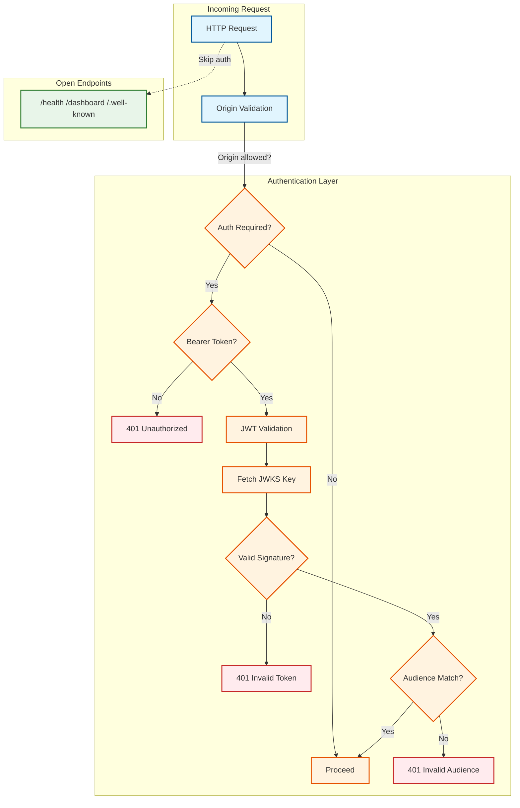

---

## 12. Agent Card & Discovery

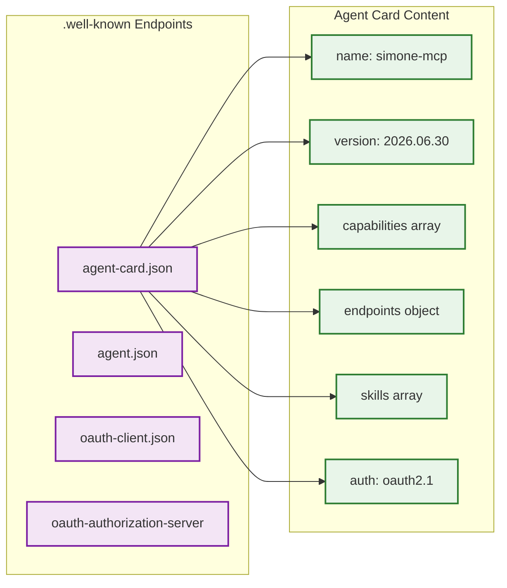

---

## Zusammenfassung

Simone MCP bietet:

- **Duale Transports**: stdio für lokale Entwicklung, Streamable HTTP für Remote
- **A2A Integration**: JSON-RPC Endpoint für Agent-to-Agent Kommunikation  
- **Symbol-Level Operations**: Python AST-basierte Code-Navigation und -Manipulation
- **OAuth 2.1 Ready**: Bearer Token Validation mit JWKS
- **Hybrid Memory**: Qdrant (Vector) + Neo4j (Graph) Integration
- **Production-Ready**: Docker, docker-compose, HF Spaces Deployment
- **Discovery**: .well-known Metadata für Agent Card und OAuth Configuration
